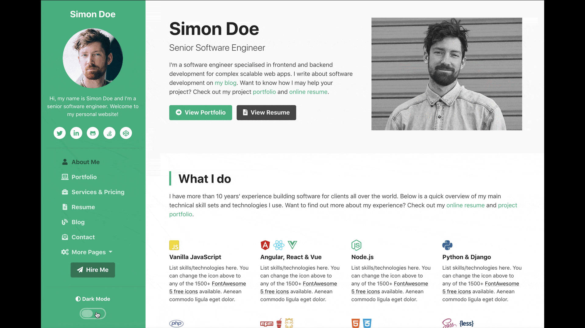

# Free Bootstrap 4 Template for Software Developers
 
## Preview

 

 
## Status

 

 
## Table of contents  
* [About](#About)
* [Features](#Features)
* [Download and Installation](#Download-and-Installation)
* [Usage](#Usage)
   * [Basic Usage](#Basic-Usage)
* [Bugs and Issues](#Bugs-and-Issues) 
* [Copyright and License](#Copyright-and-License) 
 
 
## About

This is a Bootstrap 4 Portfolio template made for software developers. Using this template, you can quickly set up an impressive online portfolio to land more work or job offers. 

This is template was created by and is maintained by **[Abbassi Zied](http://abbassizied.github.io/).

* http://abbassizied.github.io
* https://github.com/abbassizied

## Features
* Fully Responsive
* HTML5 + CSS3
* Built on Bootstrap 4
* Theme SCSS source files included
* 10 Color Schemes
* 9 Page Designs
* 1000+ FontAwesome 5 icons
* Client-side form validation
* FontAwesome
* jQuery
* Google Fonts
* Owl Carousel
* jQuery Validation Plugin
* Highlight.js
* Isotope
* js-cookie
* All images are shown for demonstration purposes only.

## Download and Installation

To begin using this template: [Fork, Clone, or Download on GitHub](https://github.com/abbassizied/Free-Bootstrap-4-Template-for-Software-Developers)

## Usage

### Basic Usage

After downloading, simply edit the HTML and CSS files included with the template in your favorite text editor to make changes. These are the only files you need to worry about, you can ignore everything else! To preview the changes you make to the code, you can open the `modified-file-name.html` file in your web browser.

## Bugs and Issues

Have a bug or an issue with this template? [Open a new issue](https://github.com/abbassizied/Free-Bootstrap-4-Template-for-Software-Developers/issues) here on GitHub

## Copyright and License

 This work is licensed under a <a rel="license" href="http://creativecommons.org/licenses/by/4.0/">Creative Commons Attribution 4.0 International License</a>.
